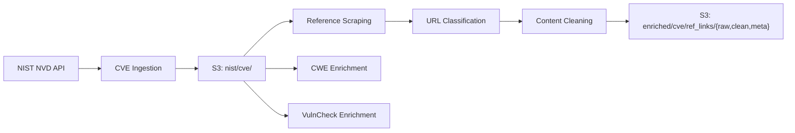
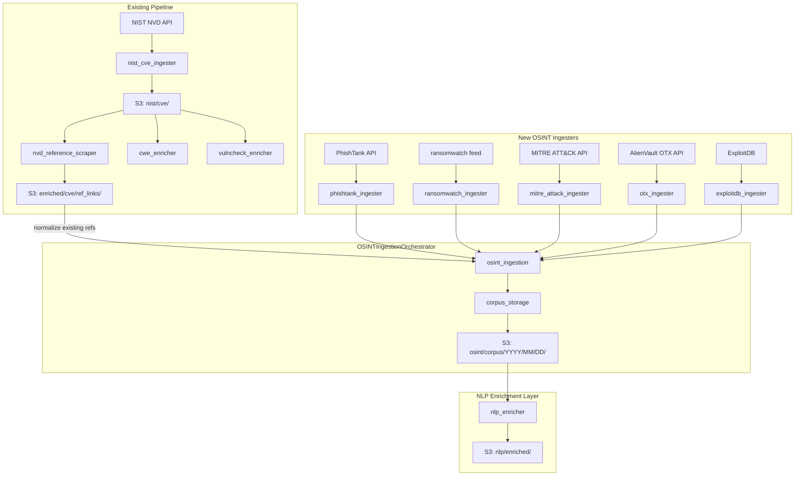

# NLP Architecture Plan

This document describes the full plan for adding an NLP enrichment layer to the ML Threat Intelligence System. It covers what we reviewed, what we recommend changing from the original draft, how the new OSINT data collection integrates into the existing pipeline, and the sprint-by-sprint implementation roadmap.

---

## 1. Current Pipeline Summary

The system today ingests CVE records from the NIST NVD API, stores them in S3 under `nist/cve/`, and then runs three enrichment steps: reference URL scraping, CWE enrichment via the MITRE API, and VulnCheck enrichment. The reference scraping pipeline, which is the most complex component, fetches each reference URL from a CVE record, classifies the URL by type (vendor advisory, GitHub advisory, patch, etc.), extracts and cleans the HTML/PDF/JSON content, scores its quality, and stores the raw content, cleaned text, and metadata JSON into S3 under `enriched/cve/ref_links/<date>/{raw,clean,meta}/`.

All of this is entirely rule-based. URL classification uses pattern matching in `src/threat_intelligence/enrichment/reference_classifier.py`. Content extraction and cleaning uses BeautifulSoup with GitHub-specific extractors in `src/threat_intelligence/enrichment/content_cleaner.py`. There is no machine learning or NLP code anywhere in the codebase today. The Python dependencies are limited to requests, beautifulsoup4, boto3, pandas, langdetect, and PyPDF2.

The existing codebase follows a clean, consistent architecture:

- **Ingesters** in `src/threat_intelligence/ingesters/` handle fetching data from external APIs, using the shared `APIClient` and `RateLimiter` utilities.
- **Enrichers** in `src/threat_intelligence/enrichment/` take existing data and augment it with additional context.
- **Storage classes** in `src/threat_intelligence/storage/` handle S3 persistence with date-based key organization.
- **Orchestrators** in `src/threat_intelligence/orchestrators/` compose ingesters and enrichers into complete pipelines.
- **Configuration** in `src/threat_intelligence/core/config.py` manages all settings through environment variables.
- **Run scripts** in `scripts/` are thin wrappers that invoke the orchestrators.



---

## 2. Tooling Decisions

### 2.1 Do Not Use skweak -- Use Snorkel Instead

The original draft proposed using skweak for weak supervision. We recommend against this. The skweak project is explicitly abandoned -- its own README states "Skweak is no longer actively maintained." The last release (v0.3.1) was published in March 2022, and there have been no meaningful code updates since. Using an abandoned library means accepting zero bug fixes, potential SpaCy version conflicts (skweak pins to SpaCy 3.x), and no community support when issues arise. Its HMM-based label aggregation, while functional, is also older than the label-model approaches available in modern frameworks.

The recommended replacement is Snorkel (`pip install snorkel`), which is the standard open-source weak supervision library. Snorkel's `LabelModel` learns the accuracy of each labeling function automatically and produces calibrated probabilistic labels without requiring any ground-truth data for training. It supports multi-class classification natively, with multi-label handled via one-vs-rest. It is well-documented, actively maintained, and has been battle-tested at scale across industry and academia. Unlike skweak, Snorkel is not tied to SpaCy and can integrate with any downstream model.

For an even lighter-weight start in Sprint 1, a simple custom majority-vote aggregation with confidence thresholds would also work. This avoids adding any framework dependency at all and can be swapped out for Snorkel's `LabelModel` in Sprint 2 if the majority vote proves too noisy.

### 2.2 Use SecureBERT 2.0 Instead of SecBERT

The original draft proposed using SecBERT (`jackaduma/SecBERT`) as the cybersecurity-domain encoder. This model is outdated and no longer maintained. Cisco AI has released SecureBERT 2.0, which is a substantial upgrade in every dimension.

SecureBERT 2.0 is built on the ModernBERT architecture and offers an 8,192-token context window (compared to SecBERT's 512 tokens). This is critical for our use case because many security advisories, threat reports, and vulnerability disclosures exceed 512 tokens, which would have required a chunking strategy. With 8K tokens, the vast majority of our documents will fit in a single pass. The model was pre-trained on over 13 billion text tokens and 53 million code tokens -- roughly 13 times the training data of the original SecBERT.

Most importantly for our timeline, Cisco has released a pre-trained NER model (`cisco-ai/SecureBERT2.0-NER`) that already extracts five entity types directly relevant to threat intelligence: Indicators of Compromise (IPs, domains, hashes), malware and exploit names, organizations, systems (affected software and platforms), and vulnerabilities (CVEs). This means the "model-based extraction for soft entities" that was planned for Sprint 2 in the original draft can be moved to Sprint 1 as inference-only work with zero fine-tuning required.

Both models are available on HuggingFace: `cisco-ai/SecureBERT2.0-base` for the base encoder and `cisco-ai/SecureBERT2.0-NER` for the NER model.

---

## 3. Architecture Review

### 3.1 What Is Strong in the Original Draft

The weak supervision approach is the correct paradigm for this project. We do not have labeled training data, and labeling functions with abstention and conflict handling are the standard way to bootstrap a classifier in this situation. The multi-label document classifier targeting Vulnerability, Exploit, Phishing, Ransomware, Threat Actor, and IOC categories aligns well with the sponsor's stated needs. The hybrid entity extraction design (regex for structured entities like CVEs and IPs, model for soft entities like threat actor names and malware families) is the standard approach in threat intelligence NLP. Starting with rule-based relations is pragmatic since ML-based relation extraction requires labeled data that we do not yet have. The proposed risk signals (exploit availability, severity cues, IOC density) are well-chosen and actionable.

### 3.2 What Needs to Change

**Data gap and input schema mismatch.** The draft describes the input as "Curated OSINT docs from `s3://ti-curated/web_clean/`" with fields like `{id, title, content, url, domain, published_at, metadata}`. However, the current pipeline does not produce anything matching that description. What exists today are per-reference cleaned texts stored under `enriched/cve/ref_links/<date>/{raw,clean,meta}/`. These are individual web page scrapes tied to specific CVE reference URLs, not unified OSINT documents. A corpus assembly step is needed that reads the cleaned texts and metadata from S3, normalizes them into the unified document schema, and stores the result. More importantly, the existing NVD reference content is heavily biased toward the Vulnerability and Exploit categories. There are essentially zero documents covering Phishing, Ransomware, or Threat Actor topics in the current data. This is addressed in Section 4 below.

**The evaluation set must come first, not last.** The original draft mentions building a QA set of 50-150 documents almost as an afterthought at the end. This needs to be Sprint 0 work, completed before any model code is written. Without a gold evaluation set, there is no way to measure whether weak supervision is working, no way to compare a TF-IDF baseline against SecureBERT 2.0, no credible metrics to present to sponsors, and no principled way to tune labeling function thresholds. The recommendation is to manually label 100 documents across all six categories before writing any model code.

**SecureBERT 2.0 NER replaces half of the hybrid extraction design.** Because the pre-trained NER model already handles malware names, organizations, systems, CVEs, and IOCs, the "model-based extraction for soft entities" originally planned for Sprint 2 becomes Sprint 1 inference-only work. The hybrid design simplifies to: regex-based extraction for CVE IDs, IP addresses, domains, URLs, hashes (MD5/SHA1/SHA256), email addresses, and CVSS scores; plus SecureBERT 2.0 NER inference (no training) for threat actor names, malware families, product and vendor names, and organization names.

**Start classification simpler.** Sprint 1 should not jump straight to fine-tuning a SecureBERT 2.0 classifier. The recommended approach is to implement labeling functions first, aggregate their outputs with majority vote, and evaluate against the gold set using just the weak labels. If the weak labels alone achieve an F1 score above 0.7, that is sufficient to ship as the MVP. Fine-tuning SecureBERT 2.0 as a multi-label classifier should only happen in Sprint 2 if the weak-label F1 is insufficient. This approach is cheaper, faster to demo, and avoids GPU dependencies in the first sprint.

**Token and chunking strategy.** With SecureBERT 2.0's 8K token context window, most documents will fit without truncation. For the occasional document that exceeds this limit, the strategy is to use the first 7,500 tokens (title followed by the beginning of the content), which captures the most informative section of security documents.

**Output integration path.** The draft says "write back to S3" but does not specify how downstream systems will consume the NLP outputs. The implementation needs to define the S3 key structure (`nlp/enriched/<date>/<doc_id>.json`), whether outputs are organized per-document or per-CVE, and how the risk management system will query these outputs (direct S3 reads, Athena, or a DynamoDB index).

---

## 4. OSINT Source Collection

### 4.1 The Problem

The current NVD reference pipeline produces content that is almost entirely in the Vulnerability and Exploit categories. To build and evaluate a classifier that covers all six taxonomy categories, we need documents from diverse threat intelligence sources. All of the recommended sources below are free and open-source, which aligns with the sponsor's cost-effectiveness requirement.

### 4.2 Sources by Category

For **Vulnerability**, the existing NVD reference texts from the current pipeline are sufficient. These are stored under `enriched/cve/ref_links/` in S3 and include security advisories, patches, and GitHub security content.

For **Exploit**, ExploitDB provides a public CSV database of exploit descriptions and detail pages. Some coverage also comes from NVD reference links that point to exploit code or proof-of-concept repositories.

For **Phishing**, the PhishTank API provides a free bulk JSON download of reported phishing URLs with metadata (it requires free registration). OpenPhish also publishes a public list of phishing URLs.

For **Ransomware**, the ransomwatch GitHub repository tracks ransomware group activity and provides a regularly updated JSON feed. Vendor blog posts from security companies like Sophos, Mandiant, and SentinelOne also cover ransomware families extensively.

For **Threat Actor**, the MITRE ATT&CK Groups API provides structured JSON data on APT groups, their techniques, and their associated malware. The APTnotes GitHub repository maintains a curated collection of links to APT reports. Malpedia provides detailed threat actor and malware family descriptions.

For **IOC** (Indicator of Compromise) content, the AlienVault OTX API provides free access to community-contributed threat intelligence "pulses" that include IOCs alongside contextual descriptions. Abuse.ch provides several useful feeds including ThreatFox (IOCs with context), URLhaus (malicious URLs), and MalwareBazaar (malware sample metadata).

### 4.3 Integration into the Existing Pipeline

These new OSINT sources are implemented as proper ingesters within the existing `src/threat_intelligence/` package, following the same architectural patterns as the NIST CVE ingester. Each ingester uses `Config` for its settings, `APIClient` and `RateLimiter` from the shared utilities package for HTTP requests, and stores its output through a new shared storage class. This ensures consistency with the rest of the codebase and avoids creating one-off scripts that drift from the established patterns.

The new modules are organized as follows:

**New ingesters** are placed in `src/threat_intelligence/ingesters/` alongside the existing `nist_cve_ingester.py` and `nist_cpe_ingester.py`. There are five new ingesters: `phishtank_ingester.py`, `ransomwatch_ingester.py`, `mitre_attack_ingester.py`, `otx_ingester.py`, and `exploitdb_ingester.py`. Each ingester fetches data from its respective external source and normalizes the output into the unified document schema described below.

**A new CorpusStorage class** is created in `src/threat_intelligence/storage/corpus_storage.py`, following the same Config-driven S3 pattern used by the existing `ReferenceStorage`. It handles storing and loading unified corpus documents to S3 under the prefix `osint/corpus/`.

**A new OSINTIngestionOrchestrator** is created in `src/threat_intelligence/orchestrators/osint_ingestion.py`, following the same composition pattern used by `NISTEnrichmentOrchestrator`. It composes all five OSINT ingesters and also includes a normalizer that reads existing NVD reference content from `enriched/cve/ref_links/` and converts it into the unified document schema. The orchestrator reports per-source ingestion results in the same format as the existing enrichment orchestrator.

**Configuration entries** are added to `src/threat_intelligence/core/config.py` using the same environment variable pattern. These include API keys for PhishTank and AlienVault OTX, rate limit settings for each source, and the corpus S3 prefix.

**A run script** is created at `scripts/run_osint_corpus_build.py` as a thin wrapper that invokes the orchestrator, following the same pattern as the existing `scripts/run_nvd_ref_scrape_from_s3.py`.

### 4.4 Unified Document Schema

Every ingester normalizes its output into the same document schema so that the downstream NLP layer can process all sources uniformly:

```json
{
  "id": "phishtank_12345_a1b2c3d4",
  "title": "Phishing attempt targeting Example Bank login page",
  "content": "A phishing page was detected at example-bank-login.com that mimics the legitimate login portal of Example Bank. The page harvests credentials including username and password...",
  "url": "https://phishtank.org/phish_detail.php?phish_id=12345",
  "source": "phishtank",
  "source_category_hint": "phishing",
  "published_at": "2025-01-15T00:00:00Z",
  "collected_at": "2026-02-18T00:00:00Z",
  "metadata": {
    "phishtank_id": 12345,
    "target_brand": "Example Bank",
    "verified": true
  }
}
```

The `source_category_hint` field records the likely category based on which feed the document came from. This is not the gold label and is not used during NLP classification. Its purpose is to help with stratified sampling when building the gold evaluation set, ensuring roughly equal representation across all six categories.

### 4.5 Target Corpus Size

The target is a minimum of 500 documents for weak supervision training, with a roughly even distribution of 80-100 documents per category. More documents are always better for weak supervision, but 500 is a practical minimum that balances collection effort against label quality. For the gold evaluation set, 100 documents are sampled from this corpus with stratification across categories, targeting approximately 15-20 documents per category.

### 4.6 S3 Storage Structure

Corpus documents are stored in S3 under a date-organized structure consistent with the existing `enriched/cve/` convention:

```
osint/corpus/YYYY/MM/DD/
  phishtank_corpus_20260218_143000.jsonl
  ransomwatch_corpus_20260218_143000.jsonl
  mitre_attack_corpus_20260218_143000.jsonl
  otx_corpus_20260218_143000.jsonl
  exploitdb_corpus_20260218_143000.jsonl
  nvd_refs_corpus_20260218_143000.jsonl
```

### 4.7 Pipeline Flow



---

## 5. Gold Set Pre-Labeling Workflow

Building a gold evaluation set of 100 labeled documents is essential for measuring whether the NLP pipeline is actually working. Rather than labeling every document from scratch (which is slow and tedious), we use a model-assisted pre-labeling approach that cuts the human effort from several hours down to roughly two hours of review.

**Step 1: Sampling.** We draw 100 documents from the assembled corpus, stratified by the `source_category_hint` field so that each of the six categories is represented by approximately 15-20 documents. This ensures the evaluation set covers all categories rather than being dominated by whichever source produced the most content.

**Step 2: Pre-labeling.** We run the same heuristic rules that will later become the weak supervision labeling functions. These include CVE pattern matching, exploit-related keyword detection, ransomware family name matching, APT pattern detection, and IOC density thresholds. Each document receives one or more predicted labels along with a confidence score indicating how many rules agreed.

**Step 3: Output.** The pre-labeled documents are written to `data/gold/prelabeled_100.jsonl`. Each entry includes the document ID, title, a content preview (first 500 characters), the source, the predicted labels with confidence scores, and a flag indicating whether the prediction needs careful review (low confidence or conflicting signals).

**Step 4: Human review.** A team member reviews each document and confirms or corrects the predicted labels. Documents where the heuristics are confident and correct require only a quick glance. Documents flagged for review need a closer read. This step takes approximately one minute per document, or roughly two hours total.

**Step 5: Final gold set.** The reviewed labels are saved to `data/gold/gold_100.jsonl` with human-verified multi-label annotations. This file becomes the ground truth for all evaluation: measuring labeling function accuracy, comparing aggregation strategies, benchmarking the classifier, and generating metrics for sponsor demos.

---

## 6. NLP Enrichment Architecture

### 6.1 Multi-Label Document Classification

The classification pipeline follows the weak supervision paradigm. For each of the six taxonomy categories (Vulnerability, Exploit, Phishing, Ransomware, Threat Actor, IOC), we define multiple labeling functions that encode domain heuristics. These functions examine each document and either assign a label or abstain if the signal is not strong enough. Abstention is important because it allows each function to focus on what it recognizes confidently rather than guessing.

For the Vulnerability category, labeling functions look for CVE ID patterns, keywords like "patch," "advisory," "CWE," and "affected versions," and the presence of CVSS scores. For the Exploit category, they detect terms like "PoC," "exploit code," "Metasploit," "RCE exploit," and GitHub repository patterns that host proof-of-concept code. For Phishing, they match on "credential harvesting," "spoofed login," "lure," "phishing kit," and related terms. For Ransomware, they detect "encrypt," "decryptor," "double extortion," and known ransomware family names. For Threat Actor, they match APT naming patterns ("APT29," "UNC####"), attribution language ("suspected," "attributed to"), and known group names. For IOC, they measure the density of IP addresses, domain names, and file hashes in the document, and look for terms like "C2" and "indicator."

Because documents can belong to multiple categories (an advisory about an APT group exploiting a vulnerability is simultaneously Vulnerability, Exploit, and Threat Actor), the classification is multi-label. Each category is treated independently using a one-vs-rest approach.

The outputs of all labeling functions are aggregated using majority vote in Sprint 1 and potentially upgraded to Snorkel's `LabelModel` in Sprint 2 if the majority vote is too noisy. The aggregated labels are evaluated against the gold set, and if the F1 score exceeds 0.7, the weak labels are shipped as the MVP output. Fine-tuning SecureBERT 2.0 as a multi-label classifier only happens if the weak labels alone are insufficient.

### 6.2 Entity Extraction

Entity extraction follows a hybrid approach that combines high-precision regex rules with a pre-trained transformer NER model.

Rule-based extraction handles structured entities where the format is well-defined and regex achieves near-perfect precision. This covers CVE IDs (the `CVE-YYYY-NNNNN` pattern), IPv4 and IPv6 addresses, domain names, URLs, file hashes (MD5, SHA-1, and SHA-256 based on their fixed lengths and hexadecimal character set), email addresses, and CVSS score mentions.

Model-based extraction uses SecureBERT 2.0's pre-trained NER model (`cisco-ai/SecureBERT2.0-NER`) in inference-only mode. This model already recognizes threat actor names, malware families, product and vendor names, organization names, and system identifiers. Because the model is pre-trained and requires no fine-tuning, it can be deployed in Sprint 1 without any GPU training costs.

The results from both extraction methods are merged into a single entity list per document, with each entity recording its type, the extracted text, its position in the document, and which extraction method produced it.

### 6.3 Relation Extraction

Relations between entities are extracted using rules in Sprint 1. These rules capture patterns like "exploit for CVE-XXXX" (producing an `exploits(entity, CVE)` relation), "APT X uses Y" (producing a `uses(actor, malware/tool)` relation), and "targets product/vendor" (producing a `targets(actor, product)` relation). Rule-based relations are high precision but limited recall -- they will catch common phrasings but miss unusual ones. Expanding to ML-based relation extraction is deferred to Sprint 2 or 3 because it requires labeled training data.

### 6.4 Risk Scoring

Each document receives a risk tier (Critical, High, Medium, Low) based on a combination of signals extracted during classification and entity extraction. The signals include whether an exploit or proof-of-concept is available, whether the document mentions active exploitation "in the wild," severity cues like "critical," "RCE," or CVSS scores above 9.0, whether ransomware is mentioned, and the density of IOCs in the document. The risk tier and its contributing signals are included in the output JSON.

### 6.5 Output Format

The NLP enrichment output for each document is stored as a JSON file in S3 under `nlp/enriched/<date>/<doc_id>.json`. The output includes the domain labels with confidence scores, the extracted entities with their types and positions, the extracted relations with evidence sentences, and the risk tier with its contributing signals.

---

## 7. Sprint Plan

### Sprint 0: Foundation and Data Collection (1-2 weeks)

The first sprint focuses entirely on building the data foundation that the NLP layer will operate on. No model code is written during this sprint.

On the pipeline integration side, we add OSINT configuration entries to `src/threat_intelligence/core/config.py` for API keys, rate limits, and the corpus S3 prefix, using the same environment variable pattern as all existing configuration. We then build the five new OSINT ingesters in `src/threat_intelligence/ingesters/`, each following the established `APIClient` and `RateLimiter` patterns. We build the `CorpusStorage` class in `src/threat_intelligence/storage/corpus_storage.py` following the `ReferenceStorage` S3 patterns. We build the `OSINTIngestionOrchestrator` in `src/threat_intelligence/orchestrators/osint_ingestion.py` following the `NISTEnrichmentOrchestrator` composition pattern, including a normalizer that reads existing NVD reference content and converts it to the unified schema. Finally, we build a run script at `scripts/run_osint_corpus_build.py` and execute the full collection to assemble a corpus of at least 500 documents across all six categories.

On the gold set side, we sample 100 documents stratified by category, run heuristic pre-labeling to generate predicted labels, and then perform a human review pass (approximately two hours) to produce the final gold set at `data/gold/gold_100.jsonl`.

On the setup side, we add the NLP dependencies (transformers, torch, snorkel, regex, spacy) to `requirements.txt` and update the package `__init__.py` files to export the new modules.

### Sprint 1: NLP MVP (2 weeks)

This sprint delivers the core NLP pipeline and produces a working demo. We implement the weak supervision labeling functions for all six taxonomy categories, aggregate their outputs with majority vote, and evaluate against the gold set. We implement rule-based entity extraction for all structured entity types (CVE IDs, IPs, domains, URLs, hashes, emails, CVSS scores). We run SecureBERT 2.0 NER inference on the corpus for soft entity extraction, requiring no fine-tuning. We implement risk signal scoring and tier assignment. All outputs are written to S3 as `nlp_enriched` JSON documents.

The sprint demo shows the end-to-end flow: a new OSINT document enters the pipeline, and the system produces domain labels, extracted entities, and a risk tier.

### Sprint 2: Improvement (2 weeks)

This sprint focuses on improving accuracy and adding capabilities. If the weak-label F1 score from Sprint 1 is below 0.7, we fine-tune SecureBERT 2.0 as a multi-label classifier using the weak labels as training data. If the majority vote aggregation is too noisy, we upgrade to Snorkel's `LabelModel` for more sophisticated label aggregation. We add rule-based relation extraction for the `exploits`, `uses`, and `targets` relation types. We add vendor and product normalization using canonicalization tables to reduce entity fragmentation (e.g., mapping "Microsoft Corp," "MSFT," and "Microsoft" to a single canonical form). We generate a formal evaluation report with precision, recall, and F1 per category.

### Sprint 3: Polish (1 week)

The final sprint focuses on quality refinement. We review low-confidence documents from the NLP pipeline to identify systematic errors, expand the gold set with additional labeled examples in areas where performance is weakest, and tune labeling function thresholds based on error analysis. If time permits, we add an active learning loop that flags low-confidence documents for human review rather than silently outputting uncertain predictions.

---

## 8. Dependencies to Add

The following packages need to be added to `requirements.txt` for the NLP layer:

```
# NLP / ML
transformers>=4.40.0
torch>=2.0.0
tokenizers>=0.19.0

# Weak supervision
snorkel>=0.9.9

# Entity extraction
regex>=2023.0.0

# Tokenization
spacy>=3.7.0
```

---

## 9. Summary of Changes from Original Draft

The original draft proposed using skweak for weak supervision. We recommend replacing it with Snorkel (or a custom majority vote for the MVP) because skweak is abandoned and no longer receives updates.

The original draft proposed using SecBERT as the domain encoder. We recommend replacing it with SecureBERT 2.0 by Cisco AI, which offers an 8K token context window (eliminating the need for chunking), 13 times more training data, and a pre-trained NER model that is ready for inference without fine-tuning.

The original draft planned to train a classifier in Sprint 1. We recommend starting with weak labels only and fine-tuning a classifier only if the weak-label F1 score is below the acceptable threshold.

The original draft planned model-based entity extraction for soft entities in Sprint 2. We recommend moving this to Sprint 1 using SecureBERT 2.0 NER inference, which requires no training.

The original draft treated the evaluation set as a late-stage nice-to-have. We recommend making it Sprint 0 work, before any model code is written, because evaluation is essential for measuring progress and demonstrating results.

The original draft assumed "curated OSINT docs" as the input, but no such data exists in the current pipeline. We recommend adding a corpus assembly step that integrates new OSINT source ingesters into the existing pipeline architecture, pulling from PhishTank, ransomwatch, MITRE ATT&CK, AlienVault OTX, and ExploitDB in addition to the existing NVD reference content.

The original draft listed risk signals as an informal bullet list. We recommend formalizing them into a structured risk tier schema with explicit scoring logic.
